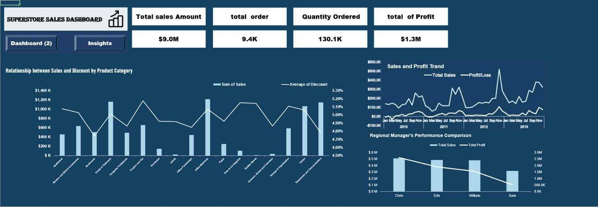
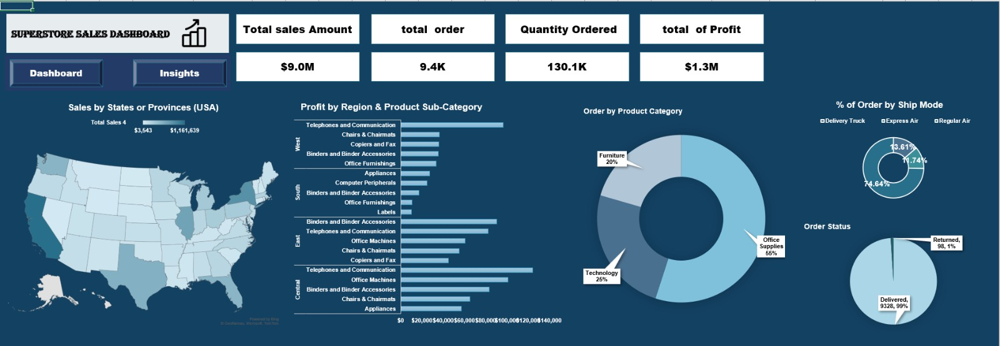
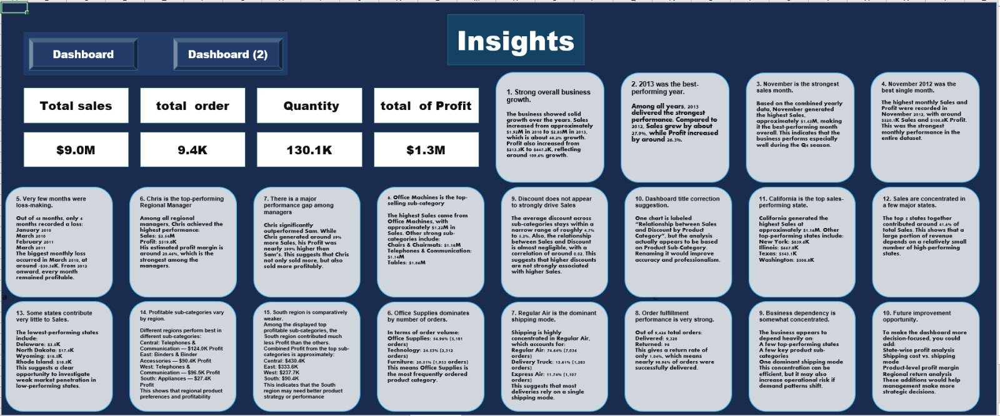

# Superstore Sales Performance Dashboard | Excel

An Excel dashboard project for analyzing Superstore sales, orders, profit, products, regions, shipping, and order fulfillment. The workbook includes source tables, an analysis sheet, two dashboards, and an insights page.

## Dashboard Preview

### Sales Performance

### Products, Regions and Orders

### Insights

## Key Metrics

| Metric | Value displayed |
|---|---:|
| Total Sales | $9.0M |
| Total Orders | 9.4K |
| Quantity Ordered | 130.1K |
| Total Profit | $1.3M |

*These are rounded values displayed in the dashboard screenshots.*

## What the Dashboards Cover

- Monthly sales and profit trends across 2010–2013
- Sales and average discount by product sub-category
- Sales and profit comparison for regional managers
- Sales by US state
- Profit by region and product sub-category
- Orders by product category
- Orders by shipping mode and fulfillment status

## Workbook Structure

| Sheet | Contents |
|---|---|
| `mean table and Orders Table` | Order and sales data |
| `Customers Table` | Customer information |
| `Users Table` | User information |
| `Returns Table` | Return information |
| `Analysis` | Supporting analysis |
| `Dashboard` | Sales trends, discounts, and manager comparison |
| `Dashboard (2)` | Geographic, product, shipping, and order analysis |
| `Insights` | Written observations |

## Selected Observations

- Office Supplies accounts for the largest share of orders in the displayed category chart (**55%**).
- The order status chart shows approximately **99% delivered** and **1% returned**.
- The regional manager comparison shows **Chris** with the highest displayed sales and profit.
- The insights page identifies **2013** as the strongest year and **California** as the top sales state.

These are observations from the workbook's displayed views. Check the underlying calculations before using an insight for a business decision.

## Tools and Techniques

- Microsoft Excel
- Pivot Tables and Pivot Charts
- KPI cards
- Map, line, bar, and doughnut charts
- Sales and profitability analysis
- Dashboard and insights reporting

## How to Use

1. [Download the Excel workbook](Excel%20Superstore%20Sales%20Performance%20Dashboard%20by%20.xlsx).
2. Open it in Microsoft Excel.
3. Start with `Dashboard` for the sales and profit overview.
4. Open `Dashboard (2)` for geographic, category, shipping, and order views.
5. Read `Insights` for the written findings.
6. Use the source tables and `Analysis` sheet to check how a result was calculated.

## Project File

[Download the Superstore Sales Performance Dashboard](Excel%20Superstore%20Sales%20Performance%20Dashboard%20by%20.xlsx)
